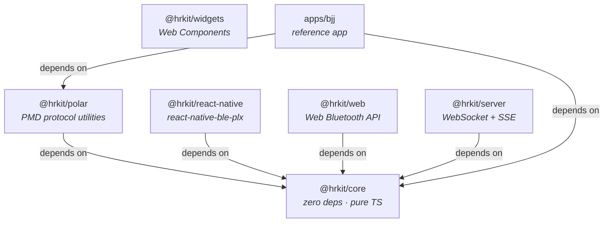

# @hrkit — BLE Heart Rate SDK

[](https://github.com/josedab/hrkit/actions/workflows/ci.yml) [](https://www.npmjs.com/package/@hrkit/core) [](https://www.npmjs.com/package/@hrkit/core) [](https://opensource.org/licenses/MIT) [](https://www.typescriptlang.org/) [](https://codecov.io/gh/josedab/hrkit) [](./fixtures/conformance)

A platform-agnostic TypeScript SDK for BLE heart rate sensors. Works with **any** standard BLE HR device (Polar, Garmin, Wahoo, Magene, generic straps). Polar devices with PMD support unlock additional protocol-level capabilities for ECG and accelerometer data parsing.

> **Try without hardware:** the SDK includes `MockTransport` for testing and prototyping — no BLE device required. See [Try Without Hardware](#try-without-hardware).

## Packages

The SDK is split into 20 focused packages — install only what you need. `@hrkit/core` has zero runtime dependencies; everything else is opt-in.

**Core & protocols**

| Package | Description |
|---------|-------------|
| [`@hrkit/core`](packages/core/) | Zero-dep core: GATT parser, HRV, zones, TRIMP, session recording, analysis, serialization, streaming metrics |
| [`@hrkit/polar`](packages/polar/) | Polar PMD protocol utilities: ECG + accelerometer command builders and parsers |

**BLE transport adapters** (implement `BLETransport`)

| Package | Description |
|---------|-------------|
| [`@hrkit/web`](packages/web/) | Web Bluetooth API adapter (Chromium-based browsers) |
| [`@hrkit/react-native`](packages/react-native/) | React Native adapter using `react-native-ble-plx` |
| [`@hrkit/capacitor`](packages/capacitor/) | Capacitor adapter via `@capacitor-community/bluetooth-le` (iOS + Android) |
| [`@hrkit/capacitor-native`](packages/capacitor-native/) | Native Capacitor plugin — direct CoreBluetooth / android.bluetooth, no community deps |
| [`@hrkit/ant`](packages/ant/) | ANT+ bridge — exposes power / cadence / HR sensors as a `BLETransport` |

**Streaming & sync**

| Package | Description |
|---------|-------------|
| [`@hrkit/server`](packages/server/) | WebSocket + SSE broadcasting, room store, WebRTC signaling |
| [`@hrkit/sync`](packages/sync/) | Local-first append-only CRDT sync, zero-dep, IndexedDB store, reconnecting transport |
| [`@hrkit/edge`](packages/edge/) | Runtime-portable HR ingestion for Cloudflare Workers / Deno / Bun |

**Export, integrations & signing**

| Package | Description |
|---------|-------------|
| [`@hrkit/integrations`](packages/integrations/) | FIT / TCX / HealthKit-style exports + Strava / Garmin / Intervals.icu / TrainingPeaks uploaders |
| [`@hrkit/bundle`](packages/bundle/) | Sign & verify conformance bundles via Web Crypto ECDSA P-256 |

**Analysis & AI**

| Package | Description |
|---------|-------------|
| [`@hrkit/coach`](packages/coach/) | Rule-engine summaries + LLM adapters (OpenAI / Anthropic / Ollama) |
| [`@hrkit/ai`](packages/ai/) | Agentic training planner — emits Workout DSL with guardrails |
| [`@hrkit/ml`](packages/ml/) | Pluggable ML inference port + model registry, BYO ONNX / TF.js runtime |
| [`@hrkit/readiness`](packages/readiness/) | Adaptive HRV baseline + multi-factor recovery scoring |

**UI & tooling**

| Package | Description |
|---------|-------------|
| [`@hrkit/widgets`](packages/widgets/) | Live dashboard Web Components: HR gauge, zone bar, HR chart, ECG strip, breath pacer, workout builder, dashboard |
| [`@hrkit/cli`](packages/cli/) | Command-line tools: `simulate` / `submit-fixture` / `keygen` / `sign` / `verify` |
| [`@hrkit/otel`](packages/otel/) | OpenTelemetry-compatible instrumentation hooks (zero-dep) |

## Architecture



BLE transport is **injected** — the core runs on any runtime. Platform adapters implement the [`BLETransport`](packages/core/README.md#bletransport) interface. The runtime data flow is:

```
BLE adapter → HRConnection → HRPacket → SessionRecorder → Session → metrics
```

## What to Install

| I want to…                              | Install                                  |
|------------------------------------------|------------------------------------------|
| Use HR metrics in a React Native app     | `@hrkit/core` + `@hrkit/react-native`    |
| Use HR metrics in a browser app          | `@hrkit/core` + `@hrkit/web`             |
| Use HR metrics in a Capacitor app        | `@hrkit/core` + `@hrkit/capacitor` (or `@hrkit/capacitor-native`) |
| Bridge ANT+ sensors                      | `@hrkit/core` + `@hrkit/ant`             |
| Parse Polar PMD protocol frames          | `@hrkit/core` + `@hrkit/polar`           |
| Stream HR data to WebSocket/SSE clients  | `@hrkit/core` + `@hrkit/server`          |
| Sync sessions across devices             | `@hrkit/core` + `@hrkit/sync`            |
| Export to FIT/TCX or upload to Strava/Garmin/Intervals/TrainingPeaks | `@hrkit/core` + `@hrkit/integrations` |
| Add live HR dashboard widgets            | `@hrkit/widgets`                         |
| Score readiness from session history     | `@hrkit/core` + `@hrkit/readiness`       |
| Run on Cloudflare Workers / Deno / Bun   | `@hrkit/core` + `@hrkit/edge`            |
| Prototype/test without BLE hardware      | `@hrkit/core` (includes `MockTransport`) |
| Build a custom platform adapter          | `@hrkit/core` (implement `BLETransport`) |
| Estimate VO2max or fitness score         | `@hrkit/core` (includes `estimateVO2maxUth`, `fitnessScore`) |
| Compute stress & recovery scores         | `@hrkit/core` (includes `computeStress`) |
| Screen for rhythm irregularities (AFib)  | `@hrkit/core` (includes `screenForAFib`) ⚠️ screening only |
| Estimate blood pressure from PTT         | `@hrkit/core` (includes `estimateBloodPressure`) ⚠️ not medical |
| Replay & annotate recorded sessions      | `@hrkit/core` (includes `SessionPlayer`) |
| Build multi-week training plans          | `@hrkit/core` (includes `PlanRunner`, `createWeeklyPlan`) |
| Fuse HR from multiple sensors            | `@hrkit/core` (includes `SensorFusion`) |
| Run a multi-athlete group session        | `@hrkit/core` (includes `GroupSession`) |

## Quick Start

### Connect to any BLE HR sensor

The example below uses [`MockTransport`](#try-without-hardware) so you can run it as-is. In a real app, swap `MockTransport` for [`WebBluetoothTransport`](packages/web/) (browser) or [`ReactNativeTransport`](packages/react-native/) (RN).

```typescript
import {
  SessionRecorder,
  connectToDevice,
  MockTransport,
  GENERIC_HR,
} from '@hrkit/core';

const transport = new MockTransport({
  device: { id: 'demo', name: 'Mock HR Strap' },
  packets: [
    { timestamp: 0,    hr: 72, rrIntervals: [833], contactDetected: true },
    { timestamp: 1000, hr: 78, rrIntervals: [769], contactDetected: true },
    { timestamp: 2000, hr: 85, rrIntervals: [706], contactDetected: true },
  ],
});

const conn = await connectToDevice(transport, { prefer: [GENERIC_HR] });
const recorder = new SessionRecorder({ maxHR: 185, restHR: 48 });

for await (const packet of conn.heartRate()) {
  recorder.ingest(packet);
}

const session = recorder.end();
console.log(`Recorded ${session.samples.length} samples`);
```

### One-Call Session Analysis

```typescript
import { analyzeSession } from '@hrkit/core';

const analysis = analyzeSession(session);
console.log(`TRIMP: ${analysis.trimp}`);
console.log(`RMSSD: ${analysis.hrv?.rmssd}`);
console.log(`Zone 5 time: ${analysis.zones.zones[5]}s`);
```

### Save & Load Sessions

```typescript
import { sessionToJSON, sessionFromJSON, sessionToTCX } from '@hrkit/core';

// Persist to storage
const json = sessionToJSON(session);
localStorage.setItem('session', json);

// Load back
const restored = sessionFromJSON(localStorage.getItem('session')!);

// Export for Strava/Garmin
const tcx = sessionToTCX(session, { sport: 'Running' });
```

### Prefer Polar H10, fall back to any device

```typescript
import { connectToDevice } from '@hrkit/core';
import { POLAR_H10, isPolarConnection } from '@hrkit/polar';
import { GENERIC_HR } from '@hrkit/core';

const conn = await connectToDevice(transport, {
  prefer: [POLAR_H10],
  fallback: GENERIC_HR,
});

// Standard HR works on every device
for await (const packet of conn.heartRate()) {
  recorder.ingest(packet);
}

// ECG capability check (Polar PMD protocol utilities available)
if (isPolarConnection(conn) && conn.profile.capabilities.includes('ecg')) {
  console.log('Connected to a Polar device with ECG support');
}
```

### Try Without Hardware

```typescript
import { SessionRecorder, connectToDevice, MockTransport, GENERIC_HR } from '@hrkit/core';

const transport = new MockTransport({
  device: { id: 'test', name: 'Mock HR Strap' },
  packets: [
    { timestamp: 0,    hr: 72, rrIntervals: [833], contactDetected: true },
    { timestamp: 1000, hr: 78, rrIntervals: [769], contactDetected: true },
    { timestamp: 2000, hr: 85, rrIntervals: [706], contactDetected: true },
  ],
});

const conn = await connectToDevice(transport, { prefer: [GENERIC_HR] });
const recorder = new SessionRecorder({ maxHR: 185, restHR: 48 });

for await (const packet of conn.heartRate()) {
  recorder.ingest(packet);
}

const session = recorder.end();
console.log(`Recorded ${session.samples.length} samples`);
```

For a full example, run the BJJ reference app:

```bash
cd apps/bjj && npx tsx src/index.ts
```

## Key Concepts

### Device Profiles

Devices are described by `DeviceProfile` objects that declare capabilities. Consumer code requests capabilities, not specific devices:

```typescript
type Capability = 'heartRate' | 'rrIntervals' | 'ecg' | 'accelerometer';

interface DeviceProfile {
  brand: string;
  model: string;
  namePrefix: string;        // used for BLE scan filtering
  capabilities: Capability[];
  serviceUUIDs: string[];
}
```

Built-in profiles: `GENERIC_HR` (core), `POLAR_H10`, `POLAR_H9`, `POLAR_OH1`, `POLAR_VERITY_SENSE` (polar). You can also [define custom profiles](packages/core/README.md#custom-device-profiles).

### Capability Gating

The SDK is designed for graceful degradation. Standard HR features work on every device. Advanced capabilities (ECG, accelerometer) activate only on supported hardware:

```typescript
// Works on every BLE HR device
for await (const packet of conn.heartRate()) { /* ... */ }

// Only available on Polar devices with PMD support
if (isPolarConnection(conn) && conn.profile.capabilities.includes('ecg')) {
  // Polar-specific features
}
```

## Development

```bash
pnpm install          # install all dependencies
pnpm test             # run tests (vitest)
pnpm test:watch       # run tests in watch mode
pnpm test:coverage    # run tests with coverage report
pnpm lint             # type-check all packages (per-package `typecheck` script)
pnpm format           # auto-format all files (biome)
pnpm check            # lint + format check (biome)
pnpm build            # build all packages (tsup, ESM output)
pnpm clean            # remove dist/ in all packages
pnpm size             # check bundle sizes
pnpm changeset        # create a changeset for versioning
```

## License

MIT
