# Architecture

@hrkit is designed around two principles: **platform-agnostic core** and **injected BLE transport**. The core library contains all the metrics and data processing. Platform-specific BLE communication is handled by swappable adapters.

## Package dependency graph

```mermaid
graph TD
    CORE["@hrkit/core<br/><i>zero deps · pure TS</i>"]
    POLAR["@hrkit/polar<br/><i>PMD protocol</i>"]
    RN["@hrkit/react-native<br/><i>react-native-ble-plx</i>"]
    WEB["@hrkit/web<br/><i>Web Bluetooth</i>"]
    CAP["@hrkit/capacitor<br/><i>Capacitor BLE</i>"]
    CAPN["@hrkit/capacitor-native<br/><i>Native BLE</i>"]
    ANT["@hrkit/ant<br/><i>ANT+ bridge</i>"]
    SERVER["@hrkit/server<br/><i>WebSocket + SSE</i>"]
    WIDGETS["@hrkit/widgets<br/><i>Web Components</i>"]
    COACH["@hrkit/coach<br/><i>rule engine + LLM</i>"]
    AI["@hrkit/ai<br/><i>training planner</i>"]
    ML["@hrkit/ml<br/><i>ML inference</i>"]
    SYNC["@hrkit/sync<br/><i>CRDT sync</i>"]
    EDGE["@hrkit/edge<br/><i>edge runtimes</i>"]
    OTEL["@hrkit/otel<br/><i>OpenTelemetry</i>"]
    READINESS["@hrkit/readiness<br/><i>recovery scoring</i>"]
    INTEGRATIONS["@hrkit/integrations<br/><i>FIT/TCX/Strava</i>"]
    BUNDLE["@hrkit/bundle<br/><i>ECDSA signing</i>"]
    CLI["@hrkit/cli<br/><i>CLI tools</i>"]

    POLAR -->|depends on| CORE
    RN -->|depends on| CORE
    WEB -->|depends on| CORE
    CAP -->|depends on| CORE
    CAPN -->|depends on| CORE
    ANT -->|depends on| CORE
    SERVER -->|depends on| CORE
    COACH -->|depends on| CORE
    AI -->|depends on| CORE
    AI -->|depends on| COACH
    ML -->|depends on| CORE
    SYNC -->|depends on| CORE
    EDGE -->|depends on| CORE
    OTEL -->|depends on| CORE
    READINESS -->|depends on| CORE
    INTEGRATIONS -->|depends on| CORE
    BUNDLE -->|depends on| CORE
    CLI -->|depends on| CORE
```



- **`@hrkit/core`** has zero runtime dependencies. Every metric function is pure TypeScript.
- **`@hrkit/polar`** depends only on `@hrkit/core`. It adds Polar PMD protocol utilities.
- **`@hrkit/react-native`** and **`@hrkit/web`** each depend on `@hrkit/core` plus their platform BLE library.

## Data flow

The runtime data flow through the SDK follows this pipeline:

```
BLE Adapter → HRConnection → HRPacket → SessionRecorder → Session → Metrics
```

1. A **BLE adapter** (`ReactNativeTransport`, `WebBluetoothTransport`, or `MockTransport`) implements the `BLETransport` interface
2. Calling `connectToDevice()` scans for a device and returns an **`HRConnection`**
3. The connection emits **`HRPacket`** objects via an async iterable
4. A **`SessionRecorder`** ingests packets and tracks state (HR, zone, rounds)
5. Calling `recorder.end()` produces a **`Session`** containing all samples and RR intervals
6. Pure **metric functions** (`rmssd`, `trimp`, `zoneDistribution`, etc.) analyze the session data

## Transport injection

The key architectural decision is that BLE transport is an interface, not a concrete implementation:

```typescript
interface BLETransport {
  scan(profiles?: DeviceProfile[]): AsyncIterable<HRDevice>;
  stopScan(): Promise<void>;
  connect(deviceId: string, profile: DeviceProfile): Promise<HRConnection>;
}
```

This means:
- The core library has **no platform imports** — it doesn't know about React Native, Web Bluetooth, or any BLE stack
- You can write a `BLETransport` for any platform (Node.js with `noble`, desktop apps, etc.)
- Tests use `MockTransport` without touching real BLE hardware
- The same application code works across platforms — only the transport changes

## What lives where

| Concern | Package | Notes |
|---------|---------|-------|
| GATT HR parsing | `@hrkit/core` | Standard BLE Heart Rate (0x2A37) |
| HRV metrics | `@hrkit/core` | RMSSD, SDNN, pNN50, baseline, readiness |
| Zones & TRIMP | `@hrkit/core` | 5-zone model, Bannister method |
| Session recording | `@hrkit/core` | Stateful, with round tracking |
| Device profiles | `@hrkit/core` | `GENERIC_HR` + Garmin, Wahoo, Magene, Suunto, Coospo |
| Artifact filter | `@hrkit/core` | RR interval outlier detection |
| Training insights | `@hrkit/core` | ACWR risk, HRV trend analysis, recommendations |
| Workout protocols | `@hrkit/core` | Tabata, EMOM, intervals, BJJ rounds engine |
| Training plans | `@hrkit/core` | Multi-week periodization with compliance tracking |
| Multi-device fusion | `@hrkit/core` | Fuse HR from multiple BLE devices |
| Sensor fusion | `@hrkit/core` | Kalman-filter multi-sensor consensus with quality scoring |
| Group sessions | `@hrkit/core` | Multi-athlete dashboards with leaderboards and zone alerts |
| VO2max estimation | `@hrkit/core` | Uth, session-based, and Cooper test methods |
| Stress scoring | `@hrkit/core` | Composite index from HRV + HR + breathing rate |
| AFib screening | `@hrkit/core` | Shannon entropy + Poincaré + turning point analysis |
| Blood pressure | `@hrkit/core` | PTT-based estimation with per-user calibration |
| Session replay | `@hrkit/core` | Playback at 1–8x speed with coach annotations |
| Plugin architecture | `@hrkit/core` | Lifecycle hooks for extensibility |
| Polar profiles | `@hrkit/polar` | H10, H9, OH1, Verity Sense |
| PMD protocol | `@hrkit/polar` | ECG/ACC command builders and parsers |
| React Native BLE | `@hrkit/react-native` | Wraps `react-native-ble-plx` |
| Web Bluetooth BLE | `@hrkit/web` | Wraps `navigator.bluetooth` |
| Capacitor BLE | `@hrkit/capacitor` | Via `@capacitor-community/bluetooth-le` |
| Native Capacitor BLE | `@hrkit/capacitor-native` | Direct CoreBluetooth / android.bluetooth |
| ANT+ BLE | `@hrkit/ant` | Wraps `ant-plus-next` as BLETransport |
| HR data server | `@hrkit/server` | WebSocket + SSE broadcasting |
| Dashboard widgets | `@hrkit/widgets` | HR gauge, zone bar, HR chart, ECG strip, breath pacer, workout builder, dashboard |
| Coaching cues | `@hrkit/coach` | Rule-engine summaries + LLM adapters |
| AI training planner | `@hrkit/ai` | Agentic workout DSL generation |
| ML inference | `@hrkit/ml` | Pluggable InferencePort, model registry |
| Integrations | `@hrkit/integrations` | FIT/TCX export, Strava/Garmin uploaders |
| Session sync | `@hrkit/sync` | Local-first CRDT sync, IndexedDB store |
| Edge runtime | `@hrkit/edge` | Workers / Deno / Bun HR ingestion |
| Readiness scoring | `@hrkit/readiness` | Adaptive HRV baseline + recovery model |
| Observability | `@hrkit/otel` | OpenTelemetry tracing + metrics hooks |
| CLI tools | `@hrkit/cli` | simulate, submit-fixture, keygen, sign, verify |
| Conformance bundles | `@hrkit/bundle` | Web Crypto ECDSA P-256 sign & verify |

## Pure functions

All metric functions in `@hrkit/core` are pure: no classes, no state, no side effects. Pass data in, get results out.

```typescript
rmssd([800, 810, 790, 820, 805]);  // → 14.2
hrToZone(162, { maxHR: 185, zones: [0.6, 0.7, 0.8, 0.9] });  // → 4
trimp(samples, { maxHR: 185, restHR: 48, sex: 'male' });  // → number
```

The only stateful abstraction is `SessionRecorder`, which accumulates packets over time. Everything else is a function call.
